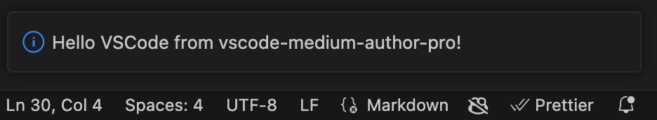
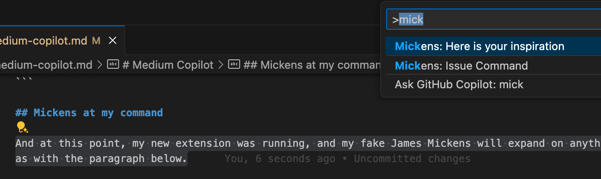

# Using Copilot to generate a Medium James Mickens Copilot

This will be my debut post on Medium, as I prepare to try to practice to be somewhat of an influencer, maybe. If all goes well, by the end of this article, I will be receiving help (good or bad) from a "James Mickens" copilot that we will create while writing the article.

Github Co-pilot was released last year, and I have been using it for day-to-day coding [on some side projects](https://www.strobopro.se). As I am new at this whole Medium thing, I felt it would be nice to have a copilot by my side helping me to type this article. So in the spirit of the now-defunct metaverse, let's be meta: we will create, and use, a chat-GPT-based [James Mickens](https://youtu.be/ajGX7odA87k?si=RtEDsCwoGKziRGP4) vscode extension to write this article.

## Creating a James Mickens VS Code Extension

First, I followed the Getting Started instructions at [https://code.visualstudio.com/api/get-started/your-first-extension](https://code.visualstudio.com/api/get-started/your-first-extension).

- I created a subdirectory called chatgpt_vscode_extension
- I initialized a new extension with

```sh
npx --package yo --package generator-code -- yo code
```

- I followed the instructions, and chose to call my extension vscode-medium-author-pro

AAAAND... I have a template... As one does, I need to check of "Hello World" is working...


After navigating the instructions and opening the new subdirectory in vscode, I was able to spawn a new vscode window (F5) and have it print "Hello VSCode" when running the extension with shift-cmd-P.



## Updating with ChatGPT Fake Mickens

I needed to now update this extension to do "something" after I had stopped typing, so I prompted copiliot with

```prompt
Please help me update this vscode extension so I can highlight some text and then issue a command and fetch the hightlighted text?
```

And it responded with the following code snippet (slightly fixed up extension.ts)
```ts
    const disposable = vscode.commands.registerCommand(
      'vscode-medium-author-pro.mickensOnCommand',
      () => {
        const editor = vscode.window.activeTextEditor;
        if (editor) {
          const text = editor.document.getText(editor.selection); // Get selected text
          const buffer = Buffer.from(text, 'utf-8'); // Get text as utf-8

          vscode.window.showInputBox({ prompt: 'Enter your command' }).then((value) => {
            if (value) {
              const command: string = value;

              /// To be continued...
```

## Adding the secret sauce: ChatGPT API Keys

Taking this prompt, we add some code to send this to chatGPT together with a promt

```ts
          vscode.window.showInputBox({ prompt: 'Enter your command' }).then((value) => {
            if (value) {
              const command: string = value;
              const prompt =
                 "You are James Mickens, and you are helping me to complete my Medium article. Write a paragraph giving your colorful prognostications to this text, but don't mention yourself :" +
                command + ':' + buffer;
              vscode.window.showInformationMessage('Sending to chatGPT...'); 
              
              // Ask chatGPT for completion
              getGptCompletion(prompt).then((response) => {
                // Get the completion
                editor.edit((editBuilder) => {
                  // Insert the completion into the editor
                  editBuilder.insert(editor.selection.end, '\r\n' + response);
                });
              });
            }
          });
```          


## James Mickens at My Command

And at this point, my new extension was running, and my fake James Mickens will expand on anything I write, such as with the paragraph below.



_I can already see the chaos this fake James Mickens extension will bring. Imagine the wild takes and bold statements that will be made, all in the name of parody. It's going to be a rollercoaster of emotions for sure, but also a hilarious ride that we won't be able to resist. Get ready for some outlandish predictions and exaggerated commentary that will have us all laughing out loud. Who knows what kind of hot takes will come next? Strap in, because this is gonna be one wild ride._

## Conclusion

So, how useful is it having James Mickens as a copilot? Well, this is my first Medium article, so having James Mickens as a copilot is like _having a mix of a stand-up comedian and a tech genius guiding your way. With James Mickens as your copilot, get ready for a journey filled with witty anecdotes, sarcastic humor, and insightful perspectives on the world of technology. It's like having a trusty sidekick who can make you laugh while also dropping some serious knowledge bombs along the way. Buckle up, because with James Mickens by your side, you're in for a wild and entertaining ride._

