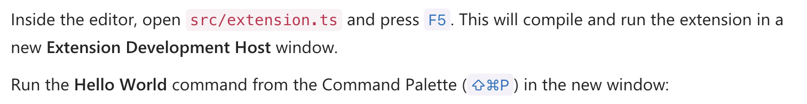

# Medium Copilot

This will be my debut post on Medium, as I prepare to try to practice to be somewhat of an influencer, maybe.
As I'm new at this, and everyone who is new at something is also bad at that thing, I wanted to che… get some additional help from a co-pilot.

Github Co-pilot was released last year, and I have been using it for day to day coding. My first thought was that if I started "coding"
in markdown here, it would pitch in and help me out. But that didn't happen. Every character you have seen so far has come from my fingertips.

But, all is not lost; I can use my ChatGPT API key! Let's make a VSCode extension to help me write articles.

As one does, let's start with the article at [https://code.visualstudio.com/api/get-started/your-first-extension](https://code.visualstudio.com/api/get-started/your-first-extension).

So, I created a subdirectory called chatgpt_vscode_extension and initialized a new extension with

```sh
npx --package yo --package generator-code -- yo code
```

Choosing to call my extension vscode-medium-author-pro

So far, this article has been written by my fingertips and brain alone...



After navigating the instructions and opening the new submdirectory vscode-medium-author-pro in vscode, I was able to spawn a new vscode window and have it print "Hello World" by pressing F5 when focusing on my new extension.ts file, then running the extension as it says... with shift-cmd-P.

I needed to now update this extension to do "something" after I had stopped typing, so I prompted copiliot with

```prompt
Can you help me update this vscode extension so it only runs when
editing .md files, and will wait two seconds until the person has
stopped typing before printing "Hello VSCode" to the vscode window?
```

And it responded that I should add a timeout like this:

/// Placeholder

And at this point, my new extension should be running!
