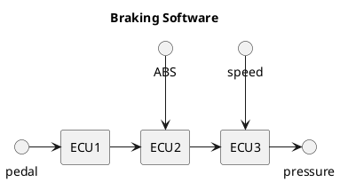

# Merging Waterfall and Agile, or DO Sweat the Details

Merging Agile and Waterfall, or DO Sweat the Details.

- Introduction

  - Waterfall used to be used for all automotive projects
  - Agile was introduced (history?)
  - Manufacturers are trying to be agile, but our timelines are waterfall
  - OEMs have gotten used to expecting their Tier 1 suppliers to deliver on time,
    - Regardless of Tier 1 internal processes.
    - OEMs were only responsible for requirement specifications
  - But now, OEMs must also think about their software processes
    - As OEMs move more and more development in-house, they need to tackle far more details than they did before
    - I hope that this talk will help, in some way to push OEMs and suppliers in the right direction.

- The Old School

  - Waterfall, Gantt Charts, Deadlines...
    - Show a Gantt Chart
    - Show the V diagram and where OEMs used to be involved.
    - Show the gates and stages of a vehicle release (JOB1, VP, TT, SOP, etc)
    - The details of everything at the bottom of the V were not important, the suppliers dealt with that
    - Show a swimlane of features and their delivery expectations (important - will be called back)

- The New School - Waterfall + Agile == WAGILE

  - Waterfall, must meet JOB1, VP, TT, SOP anyway
    - Agile, deliver the highest priority features first, release the backlog with OTA updates.
    - Show a swimlane of features and their delivery expectations (same as Waterfall here)
      - What is missing?
        - Base platform messaging
        - Organization, teambuilding
        - Everything else that is part of "Customer Value Delivery"... that is the point of this talk.

- What is the point of automotive software?
  - Makes the car go forwards, backwards, and turn left and right.
  - Adds differentiating features like apps, infotainment, UI, media, beeps and boops.
  - Both of these are considered customer value, right? What else is customer value?    
    - What gives exactly 0 customer value?
      - The colour of the emojis used in your documentation?
      - Unnecessary optimization?
      - Playing code golf, shrinking code size but not improving readability      
    - What is customer value?
      - Features? Yes, obviously door locks and remote climate control are customer value.
      - A stable CI? Yes, because this ensures faster feature deliver with higher quality.
      - Well-functionaing teams? Yes, because...
      - Removal of technical debt? Yes, because...
      - Faster Pull Request Reviews? Yes, because...
      - Faster computers for the developers? Yes, because...
      - SIL testing? Yes, because...
      - **Better Engineering Experience?** Yes, because...

- **Better Engineering Experience?**
  - Regardless if we work in Waterfall or Agile, we need to ensure we have **Happy and Productive (Software) Engineers™️**. (This is the point of this talk)
- Head of Software ca. 2010: 
  1. Build teams responsible for **waterfall** requirement specification and planning of the end-to-end functionality of every feature of the car
  1. Outsource development to the **suppliers** of each ECU.

- Head of Software ca. 2024: 
  1. Build teams responsible for **waterfall** requirement specification and planning of the end-to-end functionality of every feature of the car
  1. **Manage the software teams** responsible for delivery of this software.
      1. This is a new skillset. Software engineers are not the same as "classic" requirements engineers.      
        1. Think more like the tech giants Google, Apple, Amazon
        1. Think less like OEMs of the past where suppliers took care of the Engineering Experience and the OEMs just placed requirements.

- Happy Engineering Teams

- Productive Engineering Teams
