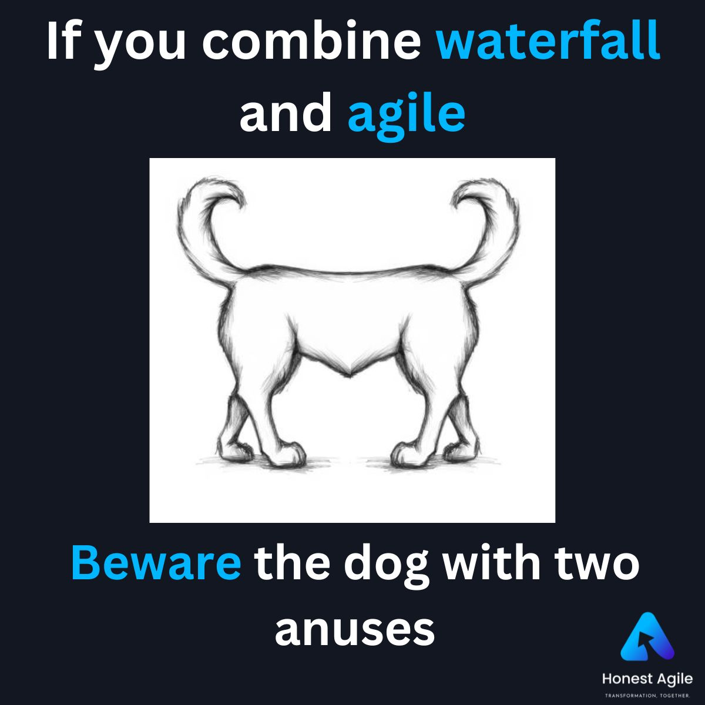
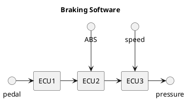
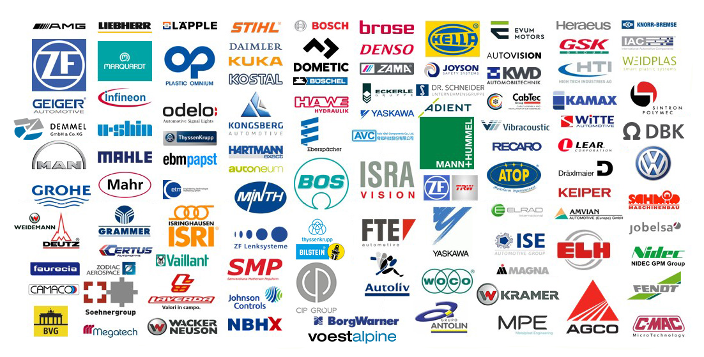
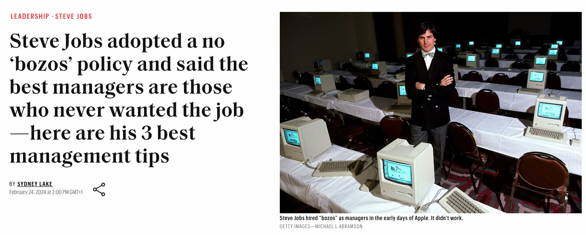
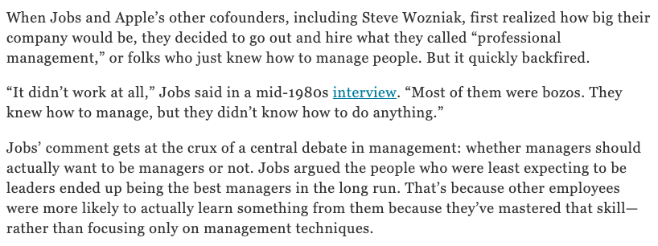
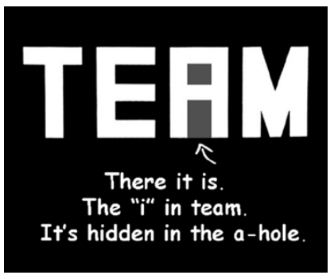
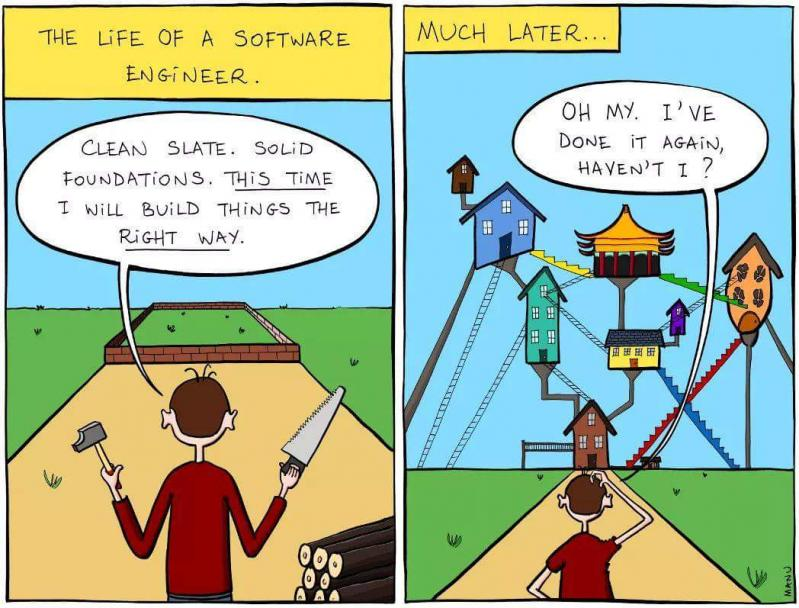
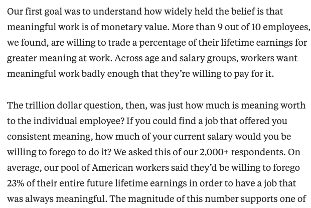
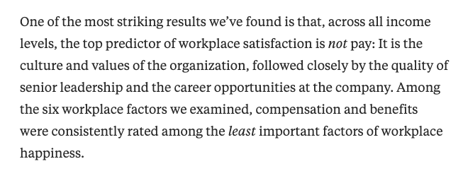

# Merging Waterfall and Agile, or DO Sweat the Details

## Storytime Introduction
Once upon a time, there were two tribes living by a beautiful lake. The Waterfall Tribe was famous for their careful planning. They made detailed blueprints for their village. Every house, every path, every tree was planned in advance. The plumbing and foundations were put in place by the plumbers and bricklayers. Their village would eventually look like a perfectly made puzzle, where everything fit together just right. 

The Agile Tribe, living on the other side of the lake, had a different way of doing things. They were known for being quick and flexible. When building their village, they would build a little, then stop and think about what to do next. This way, they could change things and try new ideas. They weren't tied down by a strict plan, which let them be creative and innovative, but their village was often rough around the edges, and sometimes they started building an area only to realize that they needed to stop, tear it down, and start again.

One day, while both tribes were still busy building their villages, a huge storm came. It brought heavy rain, strong winds, and the lake's waters began to swirl and rise. This storm threatened to ruin everything both tribes had worked on.

The Waterfall Tribe found themselves in a tough spot. Their detailed plans hadn't accounted for such a big storm; the foundations and plumbing had already planted. The temporary tents they had set up to live in while constructing the village foundations were no match for the winds of the storm, the peninsula where their fishing shack would be built had been washed away, and the the blueprints needed to be completely rewritten, and the village rebuilt, squeezing in the new fishing shack somewhere. They were stuck, unable to change their plan quickly enough to save their village. Their strict adherence to their plan resulted in a lot of destruction and delay, and a lot of the work they had already done was useless as some of these cleverly planned pipes were now covered by lakewater.

The Agile Tribe, however, was better prepared for this surprise. Their flexible way of working allowed them to respond quickly. They stopped their work, rerouted their efforts, and started building protective barriers and storm shelters. Their ability to adapt helped them minimize the damage.

But, the Agile Tribe's approach wasn't perfect either. They didn't have a clear plan, which led to some confusion and wastage. They had to keep reassessing their work, which sometimes led to mistakes and wasted resources, such as when they realized the "kitchen" team had placed the kitchen immediately upon the "plumbing" (it was really just a stream) built by the "toilets" team, and they had to rip up the kitchen and start again.

After the storm, both tribes learned important lessons. The Waterfall Tribe realized that being flexible and adaptable is as important as planning; that sometimes perfect is the enemy of good... and they had actually planned their whole village underneath the floodplain without realizing that it would be buried by the yearly floods. They learned plans need to have room for change and unexpected events, and sometimes it is OK to iterate and test their solutions rather than going all in on a plan.

The Agile Tribe, on the other hand, realized that a little bit of planning could save them from confusion and mistakes. They understood the value of having a basic blueprint to guide them, even while being quick and adaptable. The plumbing and foundations that each house had put in place were poorly built, since every family was responsible for doing their own, and every family did their own, with some sewage ditches being run right through the gardens of other huts. Had they spent more time planning and less time just building, they would have avoided the sewage smell from the kitchen, before all of it was washed away by the storm.

## Segue

I changed the details to protect the innocent, but this might resemble some projects I have been involved in in my past. The automotive industry has just woken up to the fact that Agile is not the silver bullet we were sold, and this applies to all of its variants including SAFe, Kanban, Scrum.

## The point of this talk

From the late 90s until mid 2010s I was working in a wide variety of software projects, and finally was sucked into the Gothenburg Automotive Black Hole in 2015. For the last few years I have had roles working with multiple teams working with automotive software; either directly leading them, working with in the projects, or having beer with them. During this time, I started compiling a list of things I would like to talk about if I ever get the chance to do a talk like this. That list is... really long. 

I don't give talks very often, and I have tried to plan this talk so I basically "stick to the topic" originally given to the hosts of VECS six months ago. I initially had a long list of points, but in general, I can summarize the talk like this:

**TLDR**
1. Be pragmatic.
1. Trust people, give them a mandate, and listen to them.
1. Hours of planning can save you weeks of coding.
1. Not everything can be planned for. Whatever you do, your software will miss deadlines. 
1. Take ownership of your problems. Everyone is accountable for your successes, and your failures.
1. Be pragmatic.

## Why the title?

I've been around long enough to have seen many software engineering trends come and go. I learned about Extreme Programming, Test Driven Development, and Pair Programming in college in the 90s. At that time, standard software engineering meant Waterfall, but I had one teacher who came straight from industry, and was all in on the modern trends. (we ended up hiring him away from the college t the semiconductor startup I worked at after graduation.) 

The agile manifesto was written in 2001, and it changed the engineering world, but Lean, TDD, XP all existed before the Agile Manifesto did.

Trends come and go, resulting in a constantly shifting list of "best practices" that eventually get 💩ed on by the next generation of mid-level engineers with stars in their eyes for the next big thing.

At the individual contributer and engineering manager level, it is often the mid-level engineers that get idealistic and dogmatic about the most recent engineering trends. Oftentimes, they have enough success and years of experience to be granted a nice title (and the ego to go with it). 

How do I know this? I was once one of these *mid-level engineers,* evangelizing for the newest thing in, what I saw as an industry run by aging 9-to-5ers who weren't keeping up with the trends. It doesn't matter what dogma I was pushing; It was the newest thing, so it was better than the older things.


## How does this apply to Automotive Software

Software has been in vehicles since the 70s. When I worked at National Semiconductor in the early 2000s, we were still selling a 1970s era 4-bit microprocessor to the automotive industry. "It just worked, why change it?"

Until recently, however, automotive software engineering relied mostly on suppliers to do software development, and the car companies focused on requirement specifications defining each end-to-end function in the car, and how these functions were to be split between the ECUs in the car. The design of a car with its various gates (VP, TT, JOB1, MP, PP, SOP, etc) and its supplier-based software development lends itself to waterfall; requirements are released to the suppliers, the suppliers do the software in their "magic software factory" (we'll get to that), and ECUs and software deliveries are shipped back to the OEM.

In this mode, car companies didn't need to think about the processes used by their suppliers to write their software, as long as they followed known-good processes, this was fine. Car companies said "when signal B does X, then signal A should do P" and the suppliers put their "Code Monkeys" to work 🙈.

## What has Changed?

OEMs recently started moving much of their software engineering in-house. Instead of only doing requirements, we decided to do away with much of the requirements-dependant, supplier-based-waterfall model and embrace "Agile. " Unfortunately, just as a mid-level software engineer, OEMs went all in on Agile as if it was a magic bullets. But we are now finally realizing that the promise of Agile is no panacea.

"Senior Management" at many auto companies have been accustomed to operating within a supplier-based software environment, characterized by a focus on meeting deadlines through a system of gates and finger-pointing 👉 (at suppliers) when targets were not achieved.

## Engineering Leadership 

Perhaps Senior Management has never written a line of code; their career path to "Head of Engineering" likely included no coding. Their title gives them the self confidence (and self importance), but they have overseen "Software Requirements," not "Software Engineering." and there is a world of difference between the two. This disconnect leads to poor software engineering experience at automotive companies, a lack of understanding and empathy from leadership on the benefits of force multipliers like platform engineering, dev-ops, and stable CI, etc, because none of these are "direct customer value." Poor software engineering experience leads to difficulty in recruiting and retaining the best people.

## Don't Treat Software Engineers like Suppliers

It is completely fine to point fingers, yell and scream when a supplier misses a deadline or delivers poor quality. You have a business relationship with this company; they signed a contract, and it is their job to ensure not only that features are delivered on time and with high quality, but also to own the internal processes that ensure this will happen. 

### You are the Supplier

OEMs are now the supplier. Not only do OEMs need to create the high-level design and the requirements, but we also need to create an environment where the very best software engineers will come together to create the very best code for our cars. 

```math
\text{Requirements Engineers} \neq \text{Software Engineers}
```

This culture of finger-pointing and "lack of trust" when deadlines are missed doesn't translate well now that car companies have their own internal software teams, but car companies risk taking entirely too long to realize this.

What most of these OEMs didn't realize was that 

This will require a cultural shift within senior management, as they adapt to a more hands-on approach to software engineering. Embracing this change will be crucial for car companies to stay competitive in the rapidly evolving landscape of automotive technology. 


## WAGILE: AKA "A Few Weeks of Programming Can Save You Hours of Planning."



  - Agile was introduced (history?)
  - Manufacturers are trying to be agile, but our timelines are waterfall
  - OEMs have gotten used to expecting their Tier 1 suppliers to deliver on time,
    - Regardless of Tier 1 internal processes.
    - OEMs were only responsible for requirement specifications
  - But now, OEMs must also think about their software processes
    - As OEMs move more and more development in-house, they need to tackle far more details than they did before
    - I hope that this talk will help, in some way to push OEMs and suppliers in the right direction.

- The Old School

  - Waterfall, Gantt Charts, Deadlines...
    - Show a Gantt Chart
    - Show the V diagram and where OEMs used to be involved.
    - Show the gates and stages of a vehicle release (JOB1, VP, TT, SOP, etc)
    - The details of everything at the bottom of the V were not important, the suppliers dealt with that
    - Show a swimlane of features and their delivery expectations (important - will be called back)

- The New School - **Waterfall + Agile = WAGILE**

  - Waterfall, must meet JOB1, VP, TT, SOP anyway
    - Agile, deliver the highest priority features first, release the backlog with OTA updates.
    - Show a swimlane of features and their delivery expectations (same as Waterfall here)
      - What is missing?
        - Base platform messaging
        - Organization, teambuilding
        - Everything else that is part of "Customer Value Delivery"... that is the point of this talk.

- What is the point of automotive software?
  - Makes the car go forwards, backwards, and turn left and right.
  - Adds differentiating features like apps, infotainment, UI, media, beeps and boops.
  - Both of these are considered customer value, right? What else is customer value?    
    - What gives exactly 0 customer value?
      - The colour of the emojis used in your documentation?
      - Unnecessary optimization?
      - Playing code golf, shrinking code size but not improving readability      
    - What is customer value?
      - Features? Yes, obviously door locks and remote climate control are customer value.
      - A stable CI? Yes, because this ensures faster feature deliver with higher quality.
      - Well-functionaing teams? Yes, because...
      - Removal of technical debt? Yes, because...
      - Faster Pull Request Reviews? Yes, because...
      - Faster computers for the developers? Yes, because...
      - SIL testing? Yes, because...
      - **Better Engineering Experience?** Yes, because...

- **Better Engineering Experience?**
  - Regardless if we work in Waterfall or Agile, we need to ensure we have **Happy and Productive (Software) Engineers™️**. (This is the point of this talk)
- Head of Software ca. 2010: 
  1. Build teams responsible for **waterfall** requirement specification and planning of the end-to-end functionality of every feature of the car
  1. Outsource development to the **suppliers** of each ECU.


<a href="https://www.utpb.de/en/utpb/reference/">

</a>

- Head of Software ca. 2024: 
  1. Build teams responsible for **waterfall** requirement specification and planning of the end-to-end functionality of every feature of the car
  1. **Manage the software teams** responsible for delivery of this software.
      1. This is a new skillset. Software engineers are not the same as "classic" requirements engineers.      
        1. Think more like the tech giants Google, Apple, Amazon
        1. Think less like OEMs of the past where suppliers took care of the Engineering Experience and the OEMs just placed requirements.
- What are the new skills needed for this role? 
  - Steve Jobs 
    <div style="border: 1px solid black; box-shadow: 2px 2px 4px rgba(0, 0, 0, 0.5);">
      
            
    </div>
- Now, Apple almost failed at the end of the 90s, and Steve Jobs was a notoriously bad manager with major ego problems, as we will get into later. And following his advice to a tee might mean you put your best individual contributors in a position they are bad at, meaning you **lose a great individual contributor and gain a terrible manager**.

Is it the management team, or the engineers themselves, who should be doing the engineering work and making most of the decisions? It's the team! Otherwise, what are the engineers for? Give Engineering Teams the mandate to solve the problems... let them become autonomous, but when they stall, help them get going again. How does that work in a giant automotive codebase? We'll get to that...

**- Hire People You Trust, and then Trust Them.**
  - Even if you haven't worked as an Engineer, the fact that you have some great Engineers in your team means they have the autonomy to solve the difficult problems they have to solve, the psychological safety to reveal weaknesses in the team, and can help you screen when you need to hire another team member or even if you need to hire their new manager. "Above All Else, Resist the Urge to Manage."

**- Hire People that are Better than You, and Can Replace You.**
  - Trying to do this will instill in you the goal of helping your employees overachieve and reach the highest goal they can, and the pride when it happens. Don't hire pushovers; hire people that will challenge you and the current ways of working, and will actively help improve things if given the mandate by management. Having your own goal that your people will be promoted will help you find those people who can reach their next steps, and you'll be their biggest cheerleaders. 🙌

**- Deal with Low Performers Early.**
  - You might have some low performers in your teams; deal with these before they bring others down. They may need a new role. They may need more training, or a mentor. Most of all, they need to know early that you are helping them improve their performance. 


# Hiring Software Engineers

Why should leaders have done the work they are now leading? 
1. Coaching and Psychological Safety
1. Hiring the Right People

But, it's possible to have leaders who haven't done the work, but it requires one thing, Humility, or an explicit lack of arrogance. This is key at all levels of leadership. A Humble Leader knows that she doesn't need to be the best at everything (in fact, this is impossible.) A humble leader knows that she needs her teams on board to make the right decision. Regardless if the leader is a seasoned senior engineer with 20 years of experience, there is no possible way for her to have kept up with all of the changes that are constantly ongoing in our field - and the only way to scale is to rely on a team and spread the targeted knowledge throughout the team.







## Agree to Disagree / Host Leadership vs Servant Leadership

Oftentimes, individual contributors disagree about the correct path to take.


- Happy and Productive Engineering Teams
  - Engineering Experience is becoming a C-Level KPI for large "tech" companies like Microsoft, Atlassian, Github, Google, etc.
  - OEMs need **more than salary** to attract the best engineers.
    [9 Out of 10 People Are Willing to Earn Less Money to Do More-Meaningful Work](https://hbr.org/2018/11/9-out-of-10-people-are-willing-to-earn-less-money-to-do-more-meaningful-work)
    <div style="border: 1px solid black; box-shadow: 2px 2px 4px rgba(0, 0, 0, 0.5);">
      
    </div>

    [Meaning Is the New Money](https://hbr.org/2011/03/challenging-our-deeply-held-as)
    
    <a href="https://hbr.org/2017/01/what-matters-more-to-your-workforce-than-money">
        <div style="border: 1px solid black; box-shadow: 2px 2px 4px rgba(0, 0, 0, 0.5);">
    
    </div>
    </a>

# McKinsey

- Let's use McKinsey to clear up some missing details
  [Yes, you can measure software developer productivity](https://www.mckinsey.com/industries/technology-media-and-telecommunications/our-insights/yes-you-can-measure-software-developer-productivity)


# References

https://drive.google.com/drive/folders/1-1Bb0mFrHUlzniyNjHRBt2zwV6Z2emsn
